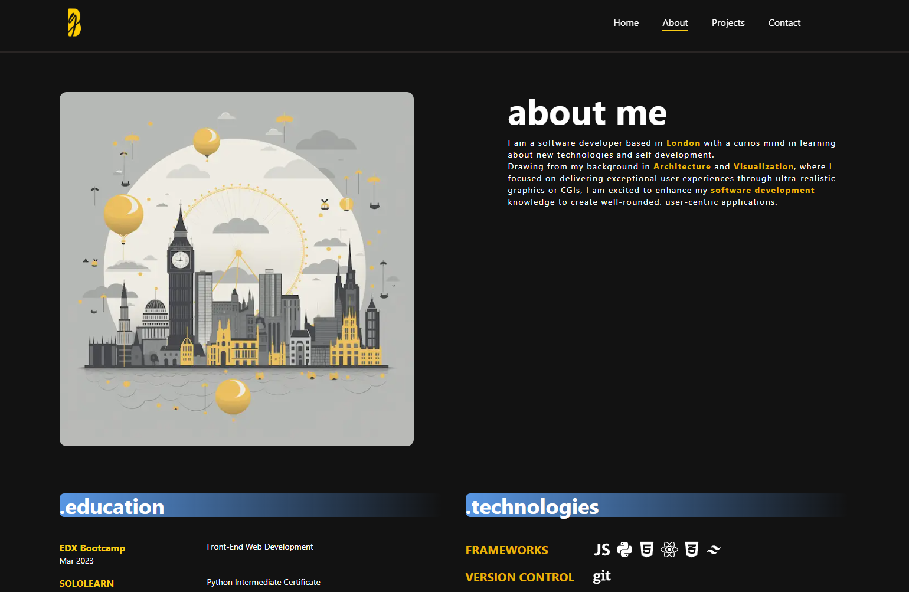

[](https://webdev-portfolio-navy.vercel.app/)

## Portfolio Developer App using NextJS and Typescript

First, run the development server:

```bash
npm run dev
# or
yarn dev
# or
pnpm dev
# or
bun dev
```

Open [http://localhost:3000](http://localhost:3000) with your browser to see the result.

## Main Packages

UX - Interractive

- Framer Motion

Icons packages

- Lucide React
- Radix UI
- React Icons

CSS

- Tailwind

## **Deployed on VERCEL** : [Portfolio](https://webdev-portfolio-navy.vercel.app/)

<div style="text-align: center">


</div>

## Light and Dark theme

A toggle button to switch from light to dark theme has been implemented
